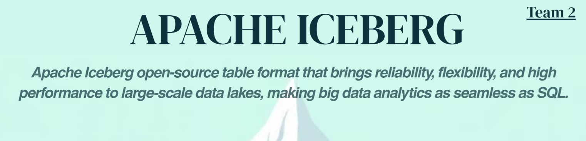
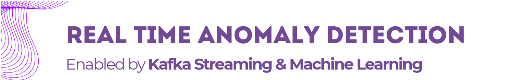
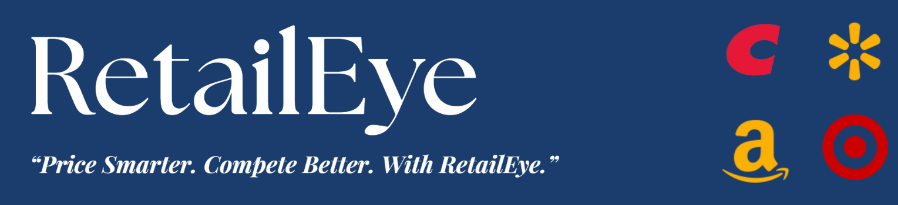
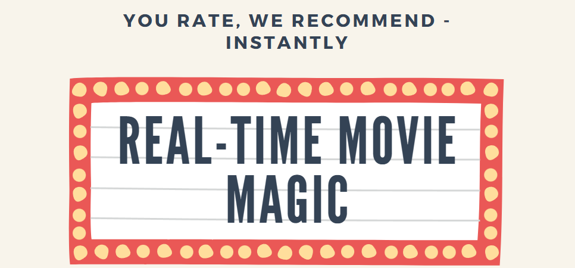
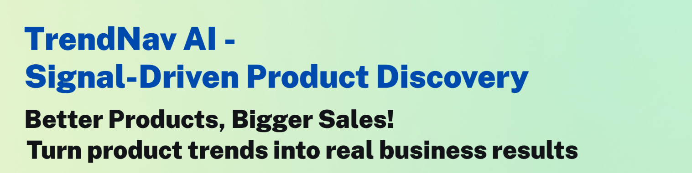
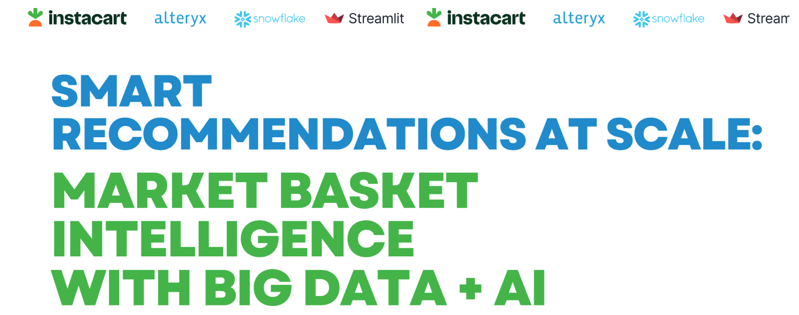
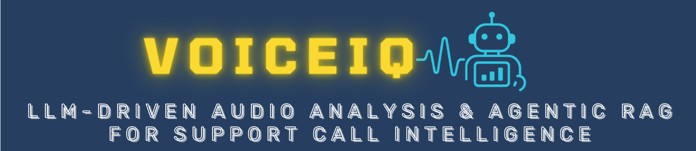
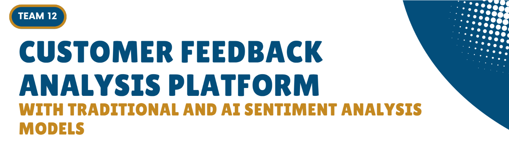
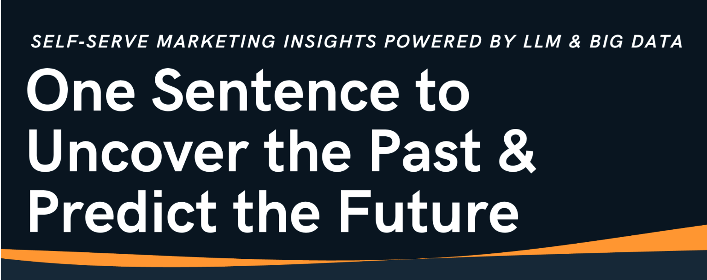
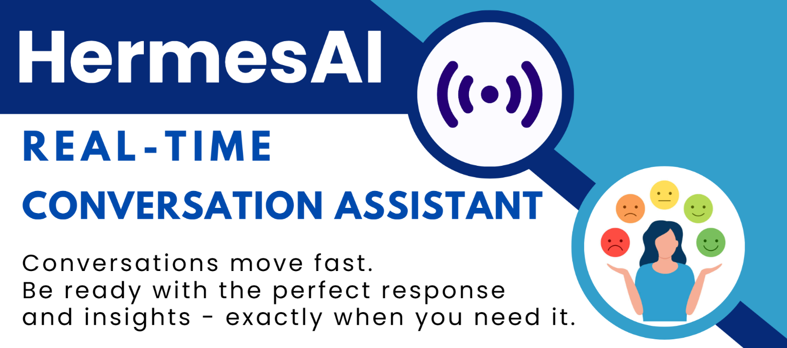

# Carlson MSBA Big Data and AI Trends Market (Spring 2025)

Use the Menu or Search Box to navigate. 

[Team 1 : Ensuring ESG Integrity in Carbon Markets through Llama 3 and Apache Spark](#team-1-:-ensuring-esg-integrity-in-carbon-markets-through-llama-3-and-apache-spark)

[Team 2 : Find Out What’s Beneath The Surface of Apache Iceberg](#team-2-:-find-out-what’s-beneath-the-surface-of-apache-iceberg)

[Team 3 : Fake News Classifier with Real-Time Explanation using SageMaker and LLMs](#team-3-:-fake-news-classifier-with-real-time-explanation-using-sagemaker-and-llms)

[Team 4 : Quality Check systems for manufacturing and any other systems real time](#team-4-:-quality-check-systems-for-manufacturing-and-any-other-systems-real-time)

[Team 5 : RetailEye: AI-Driven Product Pricing Intelligence from Competitor Listings](#team-5-:-retaileye:-ai-driven-product-pricing-intelligence-from-competitor-listings)

[Team 6 : MyMediTruth: Unmasking Misinformation in Health-Care](#team-6-:-mymeditruth:-unmasking-misinformation-in-health-care)

[Team 7 : Real-Time Movie Recommendation with Databricks & ALS](#team-7-:-real-time-movie-recommendation-with-databricks-&-als)

[Team 8 : Real-Time Price Prediction at Scale with Snowflake and Superset](#team-8-:-real-time-price-prediction-at-scale-with-snowflake-and-superset)

[Team 9 : TrendNav AI \- Social Signal-Driven Product Trend Forecasting for E-commerce Sellers](#team-9-:-trendnav-ai---social-signal-driven-product-trend-discovery-\(opportunity-scanner\)-for-e-commerce-sellers)

[Team 10 : Smart Recommendations at Scale: Market Basket Intelligence with Big Data \+ AI](#team-10-:-smart-recommendations-at-scale:-market-basket-intelligence-with-big-data-+-ai)

[Team 11 : VoiceIQ: LLM-Driven Audio Analysis & Agentic RAG for Support Call Intelligence](#team-11-:-voiceiq:-llm-driven-audio-analysis-&-agentic-rag-for-support-call-intelligence)

[Team 12 : Customer Feedback Analysis Platform with Traditional and AI Sentiment Analysis Models](#team-12-:-customer-feedback-analysis-platform-with-traditional-and-ai-sentiment-analysis-models)

[Team 13: Prompt Analytics for Ad Tech: Using LLMs to Explore Big Data Through Natural Language](#team-13:-prompt-analytics-for-ad-tech:-using-llms-to-explore-big-data-through-natural-language)

[Team 14: AI-Powered Real-Time Agent Assist Dashboard for Customer Support](#team-14:-ai-powered-real-time-agent-assist-dashboard-for-customer-support)

[Team 15: Optimizing EV Infrastructure: Predictive Maintenance with Big Data](#team-15:-optimizing-ev-infrastructure:-predictive-maintenance-with-big-data)

---

## **Team 1 : Ensuring ESG Integrity in Carbon Markets through Llama 3 and Apache Spark** {#team-1-:-ensuring-esg-integrity-in-carbon-markets-through-llama-3-and-apache-spark}

**Members**: Fnu Aastha, Apurva Baru, Anne Hackman, Sameeksha Mohan, Shang-Chien Wang, and Qirui Zheng

**Abstract:**  
This project focuses on detecting greenwashing and other potentially fraudulent activities in carbon credit transactions through the AI-driven analysis of both structured and unstructured carbon credit and offset data. As carbon credits are increasingly traded in global markets, the prevalence of fraudulent practices poses significant risks to market integrity. By leveraging Llama 3 for natural language processing-based fraud flagging and Apache Spark for high-performance anomaly detection, with insights summarized in a lightweight dashboard, this project contributes directly to the evolution of trustworthy, data-driven ESG frameworks. The resulting business insights can be utilized by a broad set of stakeholders dedicated to upholding transparency and accountability in carbon markets, including regulatory authorities, businesses concerned with their environmental impact, and environmental NGOs and advocacy organizations.

**DataSet sources:** 

* [Voluntary Registry Offsets Database](https://gspp.berkeley.edu/research-and-impact/centers/cepp/projects/berkeley-carbon-trading-project/offsets-database)  
* [Verra Registry](https://registry.verra.org/)

**Tools/Technology used:**  
Apache Spark, Azure Blob Storage, PySpark ML (Isolation Forest), OpenAI/GPT-4, Llama 3.2, Streamlit  
   
**GitHub URL**: [https://github.com/KarenaZheng/carbon-fraud-detection](https://github.com/KarenaZheng/carbon-fraud-detection)  
 

---

## **Team 2 : Find Out What’s Beneath The Surface of Apache Iceberg** {#team-2-:-find-out-what’s-beneath-the-surface-of-apache-iceberg}
**Members**: Abhinav Maharana, Akhil Sriram, Chen Ju Wang, Collin Evans, Jeswyn Jas, Steve Phillips

**Abstract:**   
Apache Iceberg is a high-performance, open-source table format designed to bring data warehouse reliability to data lakes. It offers robust features like ACID transactions, schema evolution, native support for inserts/updates/deletes, and built-in time travel via a snapshot-based model. Unlike traditional data lakes, Iceberg enables efficient data modification and querying by maintaining detailed file-level metadata, supporting hidden partitioning, and integrating natively with multiple engines like Spark, Flink, Trino, and Hive. Its engine-agnostic and open governance design sets it apart from competitors like Delta Lake and Hudi, making it ideal for large-scale, distributed data environments that require flexibility, performance, and long-term adaptability. 

**DataSet sources:**   
https://www.kaggle.com/datasets/rounakbanik/the-movies-dataset?ref=datascientyst.com\&select=ratings.csv   
**Tools/Technology used:**   
Apache Iceberg, Amazon AWS, Athena  
   
**GitHub URL**: [https://github.com/DeluxEquity/Iceberg\_Trends](https://github.com/DeluxEquity/Iceberg_Trends)

---

## **Team 3 : Fake News Classifier with Real-Time Explanation using SageMaker and LLMs** {#team-3-:-fake-news-classifier-with-real-time-explanation-using-sagemaker-and-llms}

**Members**: [Samuel Neal](mailto:neal0231@umn.edu), [Zafrin Ahmed](mailto:ahme0864@umn.edu), [Sirui Luo](mailto:luo00449@umn.edu), [Prakrit Sinha](mailto:sinha239@umn.edu), [Dylan Perreault](mailto:perre108@umn.edu), [Aakash Patil](mailto:aakpat23998@gmail.com)

**Abstract:** In this project, we developed and deployed a machine learning pipeline that classifies news articles as real or fake based on headline and body text. We fine-tuned the transformer model Distillbert and hosted it using Amazon SageMaker as a real-time inference endpoint. To provide transparency and trust in the classification process, we extended the system using a large language model (DeepSeek-R1 via OpenRouter) to generate natural language explanations of each prediction. This enables users to not only receive a binary label but also understand the rationale behind the model's decision. The system is wrapped in a user-friendly Streamlit interface, allowing users to input news content and instantly receive a prediction with interpretability. This project demonstrates a practical application of explainable AI (XAI) using real-world deployment tools, and highlights the synergy between ML models and LLMs for trust-enhancing decision support.

**DataSet sources:** [https://www.kaggle.com/datasets/clmentbisaillon/fake-and-real-news-dataset](https://www.kaggle.com/datasets/clmentbisaillon/fake-and-real-news-dataset)   
**Tools/Technology used:** AWS Sagemaker, PySpark, DeepSeek R1 API,  
   
**GitHub URL**: [https://github.com/prakrit14/Fake-News-Classifier-with-Real-Time-Explanation-using-SageMaker-and-LLMs](https://github.com/prakrit14/Fake-News-Classifier-with-Real-Time-Explanation-using-SageMaker-and-LLMs)

---

## **Team 4 : Quality Check systems for manufacturing and any other systems real time** {#team-4-:-quality-check-systems-for-manufacturing-and-any-other-systems-real-time}

**Members**: Kierzek Garrett, Hsu Ya-Chin, Dhairya Patadia, Shiran Mohammed, Vedanabhatla Venkata Sai Karthik, Tenzin Jangchup

**Abstract:** This project focuses on building a real-time quality check system for manufacturing, financial, and other operational environments. The core idea is to implement a Kafka-based streaming data pipeline that continuously monitors and detects defects or anomalies in real time. In a manufacturing setting, this enables immediate identification of faulty products, reducing machine downtime and improving overall efficiency. Similarly, in financial systems, it can detect irregular transactions or data inconsistencies on the fly. By leveraging Kafka’s high-throughput, fault-tolerant messaging system, the system ensures scalable, low-latency analytics and decision-making to maintain high standards of quality and operational integrity. The real-time data is streamed directly through Kafka topics, enabling seamless integration with live sensor feeds and enterprise systems for continuous monitoring and anomaly detection. To support fast decision-making, a Streamlit dashboard visualizes anomalies in real time, showing key metrics and operator notes for better situational awareness.

**DataSet sources:** The dataset used in this study is synthetically generated to simulate real-time telemetry and operator logs from a high-throughput industrial manufacturing environment. It combines structured time-series sensor data (e.g., temperature, vibration, pressure, speed) with unstructured text logs written by virtual machine operators. The dataset was created using Python, following realistic statistical distributions and anomaly injection techniques to mirror typical fault patterns such as overheating, pressure drops, or mechanical misalignments. Textual operator logs were simulated to reflect normal and abnormal operational conditions. 

**Tools/Technology used:** Kafka, Streamlit  
   
**GitHub URL**:  [https://github.com/garrettkierzek/realtime\_anomaly\_dashboard](https://github.com/garrettkierzek/realtime_anomaly_dashboard)

---

## **Team 5 : RetailEye: AI-Driven Product Pricing Intelligence from Competitor Listings** {#team-5-:-retaileye:-ai-driven-product-pricing-intelligence-from-competitor-listings}

**Members**: Aashi Patni, Aditya Govind Ravi Krishnan, Dipak Bhujbal, James Ashwin Rodriguez M., Yixuan (Rita) Wang	

**Abstract:** In the fast-paced world of e-commerce, retailers face the constant challenge of pricing products competitively across platforms like Amazon, Walmart, Target, and Costco. Manual monitoring of competitor prices is time-consuming and non-scalable. Our project introduces an AI-driven price intelligence platform that leverages Big Data and machine learning to automate and optimize pricing decisions.  
Built using Azure Blob Storage, Azure AI Studio with XGBoost, and Streamlit for visualization, the system scrapes competitor pricing data and extracts product attributes to deliver insights such as average pricing by category, price vs. rating analysis, and AI-based price adjustment recommendations. It also flags underpriced or overpriced items compared to similar listings.  
The platform addresses key Big Data characteristics:

* **Volume**: Millions of listings from web scraping and public datasets  
* **Variety**: Structured (prices, ratings) and unstructured (text) data  
* **Veracity**: Noisy, inconsistent, real-world data

With CI/CD automation via GitHub Actions and Generative AI explanations for model predictions, the tool provides retailers with actionable, scalable insights for smarter pricing strategies.

**DataSet sources:**   
**Tools/Technology used:** Azure Blob Storage, Azure AI Studio (Model \- XGBoost), GitHub Actions (for CI/CD), Streamlit  
   
**GitHub URL**: [https://github.com/jamesash096/retaileye](https://github.com/jamesash096/retaileye)  
(Details related to project in README file of Github repo)

---

## **Team 6 : MyMediTruth: Unmasking Misinformation in Health-Care** {#team-6-:-mymeditruth:-unmasking-misinformation-in-health-care}

**Members**: Anshu Mehta, Faithan To, Mayank Singh, Shrawani Tare, Shihao Zhao

**Abstract:**   
MyMediTruth is an AI-powered solution designed to combat the widespread issue of self-care misinformation circulating online. With public health at risk from false or misleading health claims, the system detects the credibility of user-submitted self-care statements, classifying them as real or fake. It further provides medically accurate, AI-generated explanations to help users understand the rationale behind each classification. Leveraging RoBERTa for classification and OpenAI models for explanations, the solution empowers public health professionals, educators, and the general public to make informed decisions. The platform integrates a scalable cloud-based pipeline from data ingestion to an interactive Streamlit dashboard, offering real-time analysis and insights.

**DataSet sources:** 

* FakeHealth Dataset (GitHub): For training the classification model on labeled health claims (real,, fake).  
* User-generated claims: Submitted through the Streamlit dashboard for real-time evaluation.

**Tools/Technology used:** 

* Cloud Storage: GitHub to Azure Blob Storage (Data Ingestion)  
* ETL & Preprocessing: PySpark (Databricks Community Edition)  
* Modeling:

    •  Classification: RoBERTa  
    •  Explanation: OpenAI (for generating natural language explanations)

* Deployment: Streamlit Dashboard for user interaction and real-time analysis

  
**GitHub URL**: [https://github.com/LifeOf-py/MyMediTruth](https://github.com/LifeOf-py/MyMediTruth)

---

## **Team 7 : Real-Time Movie Recommendation with Databricks & ALS** {#team-7-:-real-time-movie-recommendation-with-databricks-&-als}

**Members**: Abraham Perunthekary George, Ishan Kotian, Aaron Nelson, Tina Son, Archita Vaje, Yi Hsiang (Royce) Yen

**Abstract:** This project presents a real-time movie recommendation system designed to enhance user experience by providing personalized movie suggestions. Leveraging advanced machine learning techniques, the system integrates both collaborative filtering and content-based filtering methods to analyze user preferences and movie attributes. By processing user interactions and feedback in real-time, the system dynamically updates recommendations to reflect evolving user tastes. The implementation utilizes scalable technologies to ensure low-latency responses, making it suitable for deployment in high-traffic environments. Comprehensive evaluations demonstrate the system's effectiveness in delivering accurate and timely movie recommendations, thereby improving user engagement and satisfaction.

**DataSet sources:** [MovieLens 20M Dataset](https://grouplens.org/datasets/movielens/20m/)  
Tools/Technology used:

* PySpark (ETL & processing)  
* Spark Streaming (ingest ratings)  
* Pandas/PySpark (exploration & engineering)  
* PySpark ALS, association rule mining, frequent pattern mining  
* Databricks (deployment & monitoring)  
* Tableau

   
**GitHub URL**: [https://github.umn.edu/NEL02089/Real-Time-Movie-Recommendation-System](https://github.umn.edu/NEL02089/Real-Time-Movie-Recommendation-System)

---

## **Team 8 : Real-Time Price Prediction at Scale with Snowflake and Superset** {#team-8-:-real-time-price-prediction-at-scale-with-snowflake-and-superset}

**Members**: Olivia Boe, Divyansh Sen, Harman Singh, Swapnil Sharma, Charlotte Wang

**Abstract:** 

This project focuses on building a real-time diamond price prediction and monitoring system for retail, e-commerce, and supply chain environments. The core idea is to implement a fully Snowflake-native machine learning pipeline that continuously scores new diamond data and updates pricing predictions in real time. In a retail setting, this enables dynamic pricing adjustments, valuation audits, and customer-facing interfaces that reflect market-aligned prices. By leveraging Snowpark for model development and Snowflake UDFs for deployment, predictions are executed directly within the Snowflake environment, eliminating the need for external compute platforms and reducing pipeline complexity.

To complete the feedback loop, we integrate the prediction outputs with Apache Superset, an open-source visualization layer that enables interactive, live dashboards without the need for paid BI tools. The result is a highly scalable, cloud-native system that unifies data ingestion, model inference, and insight delivery into a single operational flow.By streaming in new data (e.g., inventory updates, customer queries, or catalog entries) and scoring it on the fly, the system ensures that pricing remains accurate and up-to-date. This architecture supports real-time business decision-making, such as spot pricing, fraud detection on undervalued listings, and customer price negotiation assistance.

**DataSet sources:** [https://www.kaggle.com/datasets/nancyalaswad90/diamonds-prices](https://www.kaggle.com/datasets/nancyalaswad90/diamonds-prices)  
**Tools/Technology used:** Snowflake \+ Superset   
   
**GitHub URL**: [https://github.umn.edu/SEN00055/End-to-End-Pipeline-for-Diamond-Price-Prediction-with-Snowflake](https://github.umn.edu/SEN00055/End-to-End-Pipeline-for-Diamond-Price-Prediction-with-Snowflake)

---

## **Team 9 : TrendNav AI \- Social Signal-Driven Product Trend Discovery (Opportunity Scanner) for E-commerce Sellers**  {#team-9-:-trendnav-ai---social-signal-driven-product-trend-discovery-(opportunity-scanner)-for-e-commerce-sellers}

**Members**: Avnee Satija, Aurosikha Mohanty, Yen-Hsi Kuo, Yaoting Huang, Ameer Akhter, Mariel Gonzalez Martinez 

**Abstract:** The project aims to solve the problem faced by small and mid-sized e-commerce sellers who lack the tools to identify emerging product trends early and end up missing out on high-demand opportunities. TrendNav AI is an AI-powered system designed to bridge this gap by continuously monitoring social media signals (Reddit, Amazon) and identifying emerging product trends before they gain traction on major marketplaces and identify high opportunity areas based on their inventory availability. The system leverages state-of-the-art NLP and marketplace mapping to deliver timely, actionable insights that help sellers optimize listings, sourcing, and inventory.

**DataSet sources:**   
Reddit API, Amazon Dataset  
[https://www.kaggle.com/datasets/malaiarasugraj/e-commerce-dataset](https://www.kaggle.com/datasets/malaiarasugraj/e-commerce-dataset)  
[https://cseweb.ucsd.edu/\~jmcauley/datasets/amazon/qa/](https://cseweb.ucsd.edu/~jmcauley/datasets/amazon/qa/)   
**Tools/Technology used:** 

* Ingestion & storage: AWS S3, Delta Lake  
* Big‑data processing: Databricks, Sagemaker AI  
* NLP & trend extraction: Sentiment Analysis using HuggingFace(Roberta), NER based BERT, Sentence‑Transformer, Fuzzy matching for category & ASIN linkage with inventory database  
* Delivery: Streamlit dashboard

   
**GitHub URL**: [https://github.com/aurosikha-mohanty/TrendNav-AI](https://github.com/aurosikha-mohanty/TrendNav-AI) 

---

## **Team 10 : Smart Recommendations at Scale: Market Basket Intelligence with Big Data \+ AI** {#team-10-:-smart-recommendations-at-scale:-market-basket-intelligence-with-big-data-+-ai}

**Members**: Dhiraj Patel, Ishaan Bhutada, Mehulkumar Patel, Sahil Sinha, Tsai-Ning Lin, Yoon Nam

**Abstract:** 

Grocery retailers often struggle to boost average basket size and customer retention without heavily relying on expensive marketing strategies. This project addresses that challenge by uncovering patterns in consumer purchasing behavior through Market Basket Analysis (MBA). Using scalable Big Data and AI tools, we aim to deliver actionable insights that drive cross-selling and improve customer loyalty.

We implemented a robust data pipeline leveraging Snowflake for data ingestion and storage, Alteryx for ETL and modeling, and Streamlit for interactive analytics. Raw order data was ingested into Snowflake and transformed in Alteryx through joins, cleaning, and creation of basket-level transactions. The Apriori algorithm, applied via Alteryx Predictive Tools, surfaced high-confidence product associations. Processed results were stored back in Snowflake for fast access.

Finally, a dynamic Streamlit dashboard showcases popular item pairings and generates personalized product recommendations. This end-to-end solution highlights how modern data tools can be integrated to unlock retail value without complex infrastructure or high costs.

**DataSet sources:** [https://www.kaggle.com/datasets/psparks/instacart-market-basket-analysis/data](https://www.kaggle.com/datasets/psparks/instacart-market-basket-analysis/data)  
**Tools/Technology used:** Snowflake, Alteryx, Streamlit  
   
**GitHub URL**: [https://github.com/mkp64/BDA\_Trends\_Market\_Basket\_Analysis](https://github.com/mkp64/BDA_Trends_Market_Basket_Analysis)  
**Video and Flyer URL**:  [BDA Trends](https://drive.google.com/drive/folders/1rrp26DbOLGqJZ99WHj4jXiHEJ1TKWnoy?usp=sharing)

---

## **Team 11 : VoiceIQ: LLM-Driven Audio Analysis & Agentic RAG for Support Call Intelligence** {#team-11-:-voiceiq:-llm-driven-audio-analysis-&-agentic-rag-for-support-call-intelligence}

**Members**: Abdihakem Bashe, Varsha Ravichandran, Pin-Shiuan Liang, Vikhyat Tomar, Raman Choudhary, Harshithan Kavitha Sukumar

**Abstract:**   
In today’s contact centers, thousands of customer service calls occur daily—each rich with insights but trapped in unstructured audio. So, we developed an AI-powered monitoring and insight platform designed to extract actionable intelligence from customer service calls. The solution not only focuses on analyzing **sentiment**, **intent**, and **engagement trends** to help organizations optimize support operations, but also for **storage optimization** by converting unstructured heavy audio calls into lightweight structured and data rich documents.

Our system is composed of three core components:

1. **Audio Analyzer** – Transforms raw audio into structured CSV format via **state-of-the-art transcription and speaker diarization**, clearly differentiating between customer and representative dialogue. This forms the foundation for downstream analysis.  
2. **Automated Call Report Generator** – Powered by open-source LLMs, this module extracts:  
* Sentiment analysis  
* Intent detection  
* Keyword extraction  
* Context-preserving summaries  
  These insights are automatically compiled into well-structured **HTML reports** for efficient review, compliance, and archival.  
3. **Retrieval-Augmented Generation (RAG) Agentic AI** – A natural language interface that allows users to:  
* Query individual or historical customer/rep interactions  
* Retrieve **aggregated insights across calls**  
* Compute metrics (e.g., average satisfaction score) via LLM-enhanced retrieval  
  Our system emphasizes **LLM-first, RAG-second** architecture, making it intuitive and more human-centric than traditional search bots.

All extracted insights are centrally stored and automatically aggregated into an interactive dashboard, empowering organizations to monitor agent performance, understand customer concerns, identify systemic issues, and drive continuous service improvements through data-driven intelligence.

**DataSet sources:** 

- Public audio data for diarization and speech-to-text processing from Azure  
- Synthetic customer service call transcripts

**Tools/Technology used:** 

* **Audio Processing and NLP**: Whisper (Openai), Pyannote (diarization), Huggingface Transformers, AssemblyAI API, OpenRouter API, Librosa (audio preprocessing)  
* **Agentic AI and RAG:** Langchain, FAISS, Streamlit, BeautifulSoup, Langchain\_community  
* **Datastores**: AWS S3, FAISS Vector Store

   
**GitHub URL**: [https://github.com/rachellg99/VoiceIQ-llm-driven-audio-analysis](https://github.com/rachellg99/VoiceIQ-llm-driven-audio-analysis)

---

## **Team 12 : Customer Feedback Analysis Platform with Traditional and AI Sentiment Analysis Models** {#team-12-:-customer-feedback-analysis-platform-with-traditional-and-ai-sentiment-analysis-models}

**Members**: Anantha Narayanan Balaji, Sikander Batcha, Ko Jen Kang, Gabriel Montague, Pankaj Nandal

**Abstract:** In today’s digital landscape, businesses receive massive volumes of customer reviews across various platforms. Manually analyzing this unstructured feedback can be time-consuming and inefficient. Our project aims to build a pipeline that helps businesses efficiently analyze large-scale customer review data.

The solution involves storing customer reviews in cloud infrastructure, processing the data through advanced sentiment analysis models, and presenting the insights in an interactive dashboard. This enables businesses to quickly understand customer sentiment, take immediate action, and uncover opportunities for innovation and product development.

A key feature of our platform is the flexibility to choose from multiple sentiment analysis models based on specific business needs. We will provide a detailed comparison of these models to help users select the most suitable one. Our goal is to empower businesses to leverage AI-driven insights for better decision-making and customer satisfaction.

**DataSet sources:** [https://business.yelp.com/data/resources/open-dataset/](https://business.yelp.com/data/resources/open-dataset/)   
**Tools/Technology used:** Azure (Blob Storage / Databricks), Sentiment Model (Google LLM / Azure Language Model/ distilbert-sst2-Hugging Face / Vader), SHAP Values  
   
**GitHub URL**: [https://github.com/aakashananth/BDA\_Trends](https://github.com/aakashananth/BDA_Trends)

---

## **Team 13: Prompt Analytics for Ad Tech: Using LLMs to Explore Big Data Through Natural Language** {#team-13:-prompt-analytics-for-ad-tech:-using-llms-to-explore-big-data-through-natural-language}

**Members**: [Bahar Behazin](mailto:behaz001@umn.edu), [Shreya Shreya](mailto:shrey003@umn.edu), [Chun-yu Chen](mailto:chen8858@umn.edu), [Tarun Kumar Deekonda](mailto:deeko002@umn.edu), [Utkarsh Joshi](mailto:joshi516@umn.edu)

**Abstract:** This project explores the integration of large language models (LLMs) into big data analytics workflows to enhance user accessibility and decision-making in digital advertising. We leverage LLMs to enable natural language querying over large-scale ad impression data. Users can type intuitive questions (e.g., “Which hours of the day have the highest click-through rates on mobile devices?”), and our system responds with dynamically generated metrics and visualizations.

Using Spark for backend data processing and a lightweight frontend (Flask), this project demonstrates how modern AI interfaces can bridge the gap between raw data and actionable insights, without requiring marketing managers to write SQL or code. This approach empowers marketing teams to explore data in real-time and make evidence-based decisions with minimal technical overhead.

**DataSet sources:** [Avazu Click-Through Rate](https://www.kaggle.com/c/avazu-ctr-prediction/data)

**Tools/Technology used:** Databricks(spark), Flask, LLMs, Visualization(Seaborn and Matplotlib)   
   
**GitHub URL**: [https://github.com/bbehaz/BDA-Trends](https://github.com/bbehaz/BDA-Trends.git)

---

## **Team 14: AI-Powered Real-Time Agent Assist Dashboard for Customer Support** {#team-14:-ai-powered-real-time-agent-assist-dashboard-for-customer-support}

**Members**: Jacob Battles, Dharmpal Jhala, Bryan Li, Anna Niedermeyer, Bhargavi Pissay, Justin Varghese

**Abstract:** AI-Powered Real-Time Assist Dashboard is a versatile co-pilot designed to enhance live business interactions — from customer support and sales calls to internal presentations and executive meetings. While most tools focus on retrospective analytics, this project shifts the focus to in-the-moment augmentation, providing real-time insights and AI-guided suggestions to improve outcomes while conversations are still unfolding.

Built on a robust streaming pipeline using Apache Kafka and Spark Structured Streaming, the system processes incoming dialogue or event data in real time. It leverages LLM APIs (OpenAI, Gemini) to extract key conversational signals: sentiment, intent, issue classification, and predicted outcomes such as CSAT or conversion likelihood. These are delivered through a lightweight Streamlit dashboard widget, which refreshes every few seconds with new insights and dynamically generated reply or action suggestions.

This tool empowers business professionals to make better decisions in real time — whether calming an upset client, adjusting a sales pitch mid-call, or fine-tuning messaging during a strategic meeting. It reduces cognitive load, enhances emotional intelligence, and links live behavior with key performance metrics like satisfaction, engagement, or deal progression.

The solution is scalable to millions of messages per day and adaptable to a wide range of industries, including e-commerce, healthcare, financial services, and enterprise SaaS — making real-time intelligence accessible to any team managing live business interactions.

**DataSet sources:**   
**Tools/Technology used:** Apache Kafka, Spark Structured Streaming, OpenAI API, Streamlit, Databricks  
   
**GitHub URL**: [https://github.com/SITONGRUC/HermesAI](https://github.com/SITONGRUC/HermesAI)

---

## **Team 15: Optimizing EV Infrastructure: Predictive Maintenance with Big Data** {#team-15:-optimizing-ev-infrastructure:-predictive-maintenance-with-big-data}

**Members**: Megan Moffatt, Rahma Hassan, Ujjwal Khanna, Soham Mukund Navandar, Harshal Sable, Chenxiang Ma,

**Abstract:** This project develops a data-driven solution to predict maintenance needs for electric vehicle (EV) charging stations, aiming to proactively minimize downtime and improve operational reliability. The dataset comprises charging stations with features like location, charger type, capacity, usage statistics, maintenance history, and installation metadata.

A key innovation in this project is the integration of weather-based risk scoring using the OpenWeather API. Historical hourly weather data—including wind, temperature fluctuations, humidity, and precipitation—was collected for each station using asynchronous API calls. A custom weather risk score was computed and normalized on a 1–10 scale to capture environmental stress.

The data was processed in Databricks, leveraging both Spark and Pandas workflows. Clustering techniques (e.g., K-Means) were applied to profile stations by usage intensity and maintenance behavior. Subsequently, an XGBoost regression model was trained on a suite of engineered features to predict days\_to\_breakdown. 

**DataSet sources :-**

**Station Metadata :** [Global EV Charging Station Dataset – Kaggle (Arif Othman)](https://www.kaggle.com/code/arifothman/global-ev-charging-station-analysis)  
**Weather & Environmental Stress Indicators:** OpenWeatherMap API   
Used to collect historical weather data for each station’s location

**Tools/Technology used:** PySpark, Kaggle API, OpenWeatherMapAPI, Spark MLib, Kepler.gl. 

**GitHub URL**: [https://github.com/harshal1711/EV\_Predictive\_Maintenance/tree/main](https://github.com/harshal1711/EV_Predictive_Maintenance/tree/main)  

