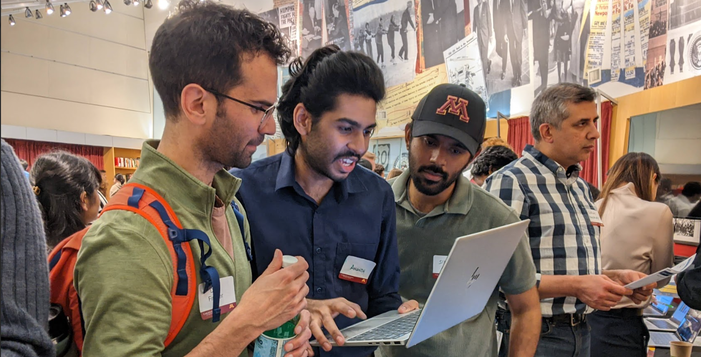

**Links:** [Projects](projects/index.md) · [Winners](winners/index.md) · [All years](../../index.md)

# Big Data and AI Trends Market (Spring 2025)

[Carlson School of Management](https://carlsonschool.umn.edu/), [University of Minnesota](https://twin-cities.umn.edu/)

[Master of Science in Business Analytics, Class of 2025](https://carlsonschool.umn.edu/graduate/masters/business-analytics)

Hosted by Professor [De Liu](mailto:deliu@umn.edu) with help of Carlson Analytics Lab, as part of MSBA 6331 Big Data Analytics
