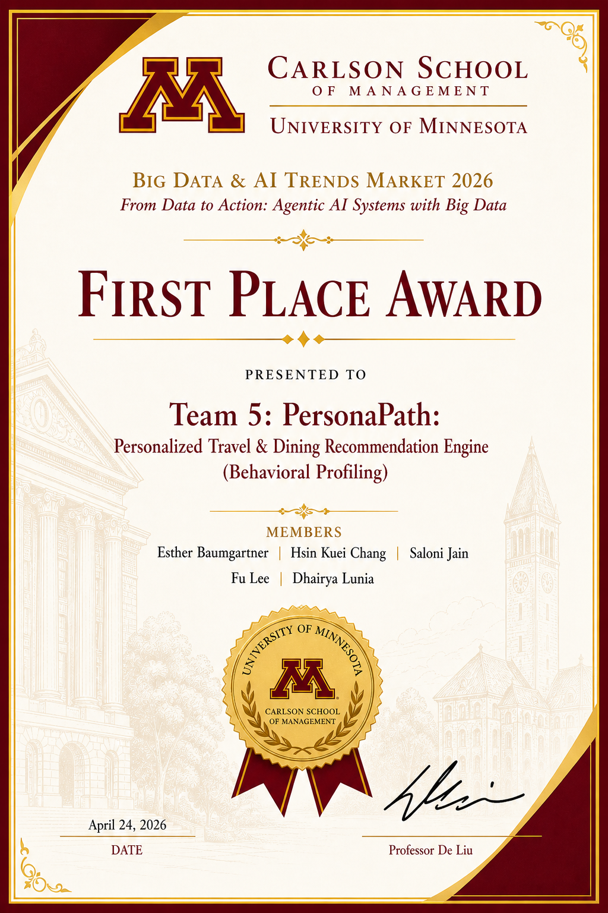
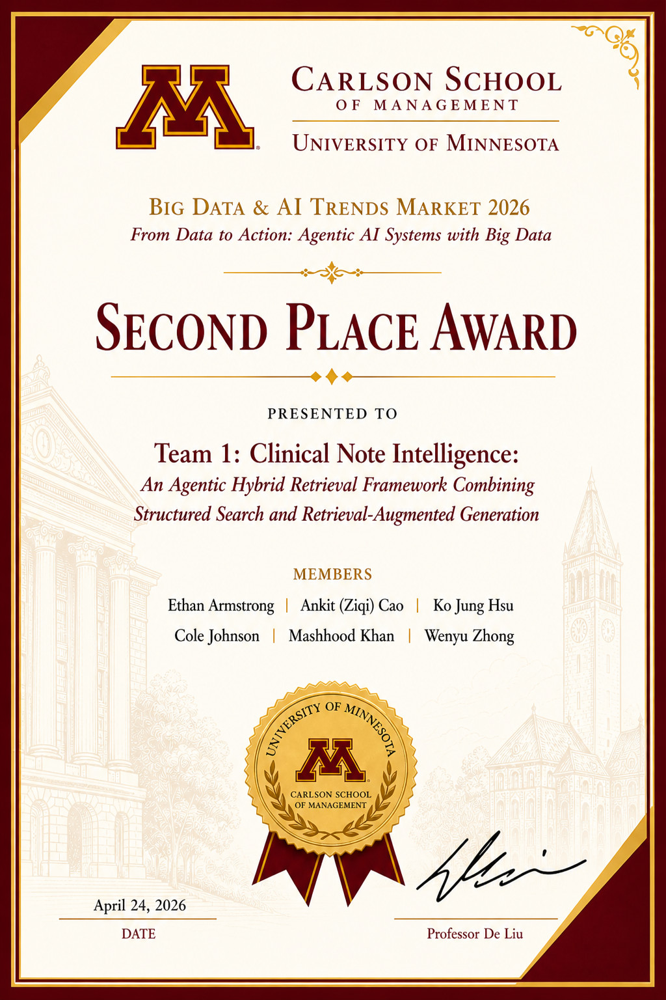
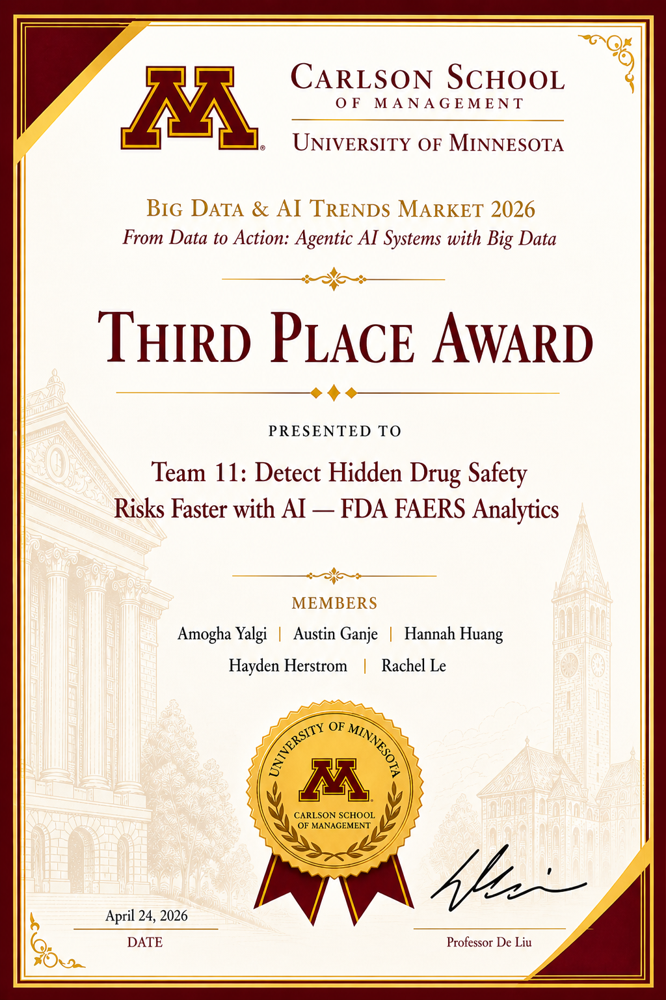
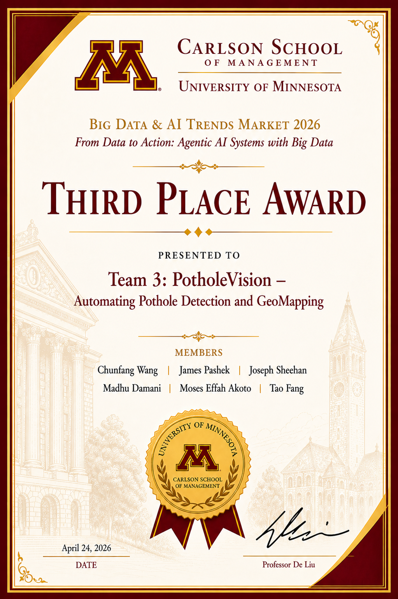
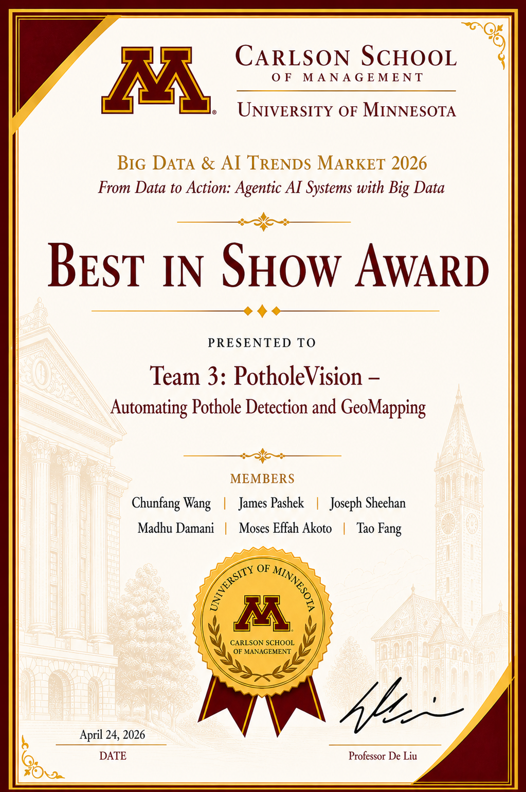
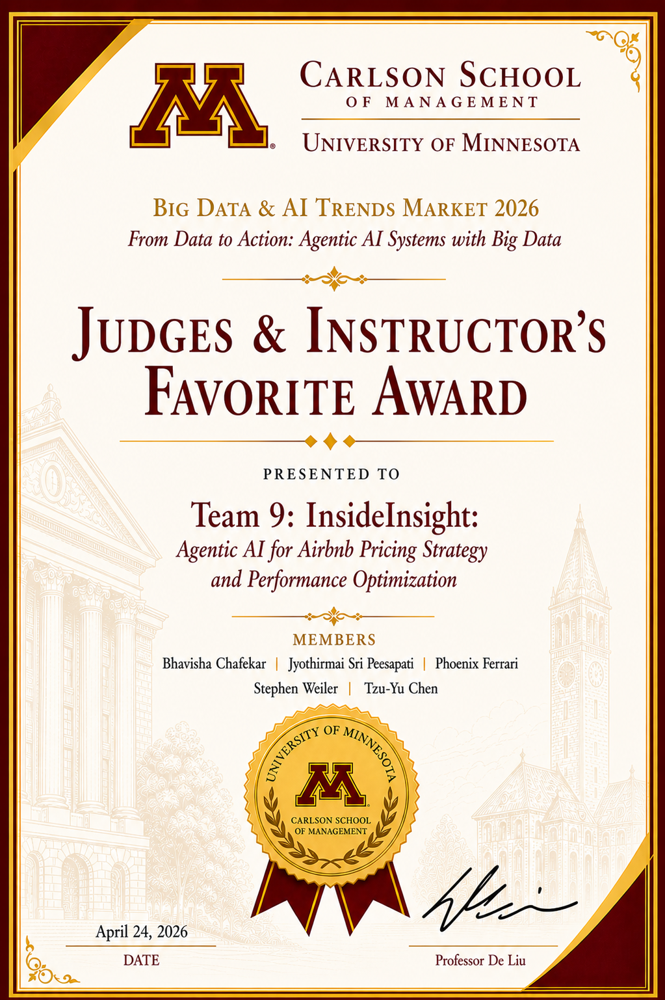

**Links:** [Spring 2026 overview](../index.md) · [Projects](../projects/index.md) · [All years](../../../index.md)

# Winners — Big Data and AI Trends Market (Spring 2026)

## **First Place**

## **Second Place**

## **Third Place (ties)**

## **Best in Show**

## **Judges and Instructor’s Favorite**

